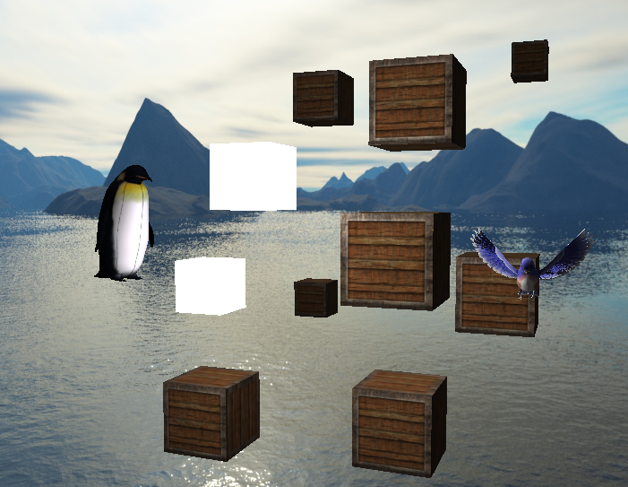
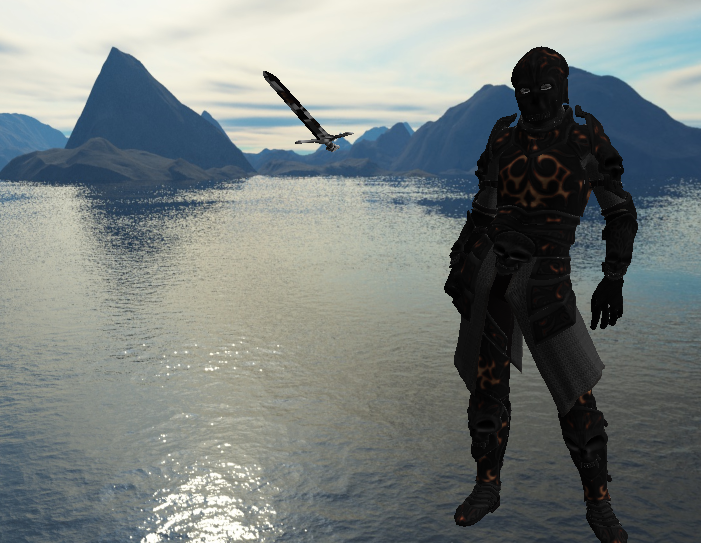
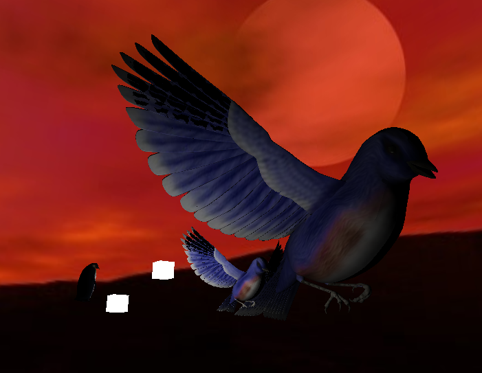

# OpenGL 3D Rendering engine

3D Rendering engine written in pure C++ with [OpenGL](https://learnopengl.com/)

## Controls

```
w,a,s,d - moving
space - up
shit - down
z - zoom
c - collisions (on/off)
mouse - camera rotation
```




